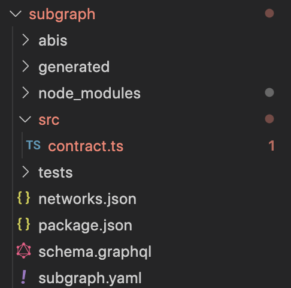

# Subgraph Development

## What is The Graph?

The Graph (Google Of Blockchains) is a protocol that gives  the ability to retrieve data from blockchains easily in a decentralized manner.
Before The Graph, dApps had to build their own data solutions to go through every single event emitted by their contract(s) and save the data locally, then build a software to filter that data.

## What is an Event?
The EVM has a logging functionality used to “write” data to a structure outside smart contracts. One such important piece of data is Solidity events. Events allow us to “print” information on the blockchain in a way that is more searchable and gas efficient than just saving to public storage variables in our smart contracts. 

These logs are associated with the address of the contract, are incorporated into the blockchain, and stay there as long as a block is accessible. The Log and its event data is not accessible from within contracts (not even from the contract that created them). It’s their inaccessibility to smart contracts that makes them cheaper to emit. 

With Solidity events, you can:

- Test your smart contracts for specific variables;
- **Index variables to rebuild storage state;**
- Listen for events to change a front end;
- **Create subgraphs for reading data faster**

This is what defining an event looks like in Solidity:
```sh
event Transfer(address indexed from, address indexed to, uint tokens);
```
You can think of this as a new special type. We have created a “type” of event called `Transfer`. The event name is called and can hold a number of variables. There are two kinds of parameters in this one event: indexed and non-indexed parameters. You can add the attribute indexed to up to three parameters which adds them to a special data structure known as “topics” instead of the data part of the log. A topic can only hold a single word (32 bytes) so if you use a reference type for an indexed argument, the Keccak-256 hash of the value is stored as a topic instead.
All parameters without the indexed attribute are ABI-encoded into the data part of the log.

Topics allow you to search for events, for example when filtering a sequence of blocks for certain events. You can also filter events by the address of the contract that emitted the event.

We can then emit an event like so:
```sh
    function transfer(address to, uint256 amount) public returns (bool) {
        address owner = _msgSender();
        _transfer(owner, to, amount);
        emit Transfer(owner,to,amount)
        return true;
    }
```
Now, anytime we call the `transfer` function in this example, it will emit an event of type `Transfer`.

Example of a sample transaction that call the `transfer` function:


#### An event is broken down like so:
- Address: The address of the contract or account the event is emitted from.
- Topics: The indexed parameters of the event.
- Data: The ABI-Encoded or “hashed” non-indexed parameters of the event.


The Graph allows you to build custom open APIs called “Subgraphs”. Subgraphs are used to tell indexers (server operators) which data to index on a blockchain and save on their servers in order for you to be able to query it at any time using GraphQL.


## Software requirements
You need to have the following installed on your computer:
- Node.js
- Any IDE. Like VS code
- The Graph CLI

The Graph CLI is written in JavaScript, and you will need to install either yarn or npm to use it.

Once you have npm, install the Graph CLI by running:
```
npm install  @graphprotocol/graph-cli
```
The above command is for Windows users. If you are using a Mac/Linux, you have to use:

```
yarn global add @graphprotocol/graph-cli
```

On a MAC/Linux system if you want to use npm there is a few more steps that need to be done before using the npm command.
First we need to change the path to be on a root level:

```
cd /
```
After you are on a root level inside terminal paste down this command:

```
export HOME=/root
```
And now we can use npm to install graph-cli:

```
sudo npm install -g @graphprotocol/graph-cli
```
Afte the graph-cli is successfully installed to get back at initial setup, you have to run the following commands:

```
export HOME=/home/$USR
cd ~
```

## Building A Subgraph
&nbsp;

### Creating a Subgraph
Once installed, the `graph init` command can be used to set up a new subgraph project, either from an existing contract on any of the public Ethereum networks or from an example subgraph. This command can be used to create a subgraph  by passing into VS code terminal `graph init`. If you already have a smart contract deployed to Ethereum mainnet or one of the testnets, bootstrapping a new subgraph from that contract can be a good way to get started.

From An Existing Contract

The following command creates a subgraph that indexes all events of an existing contract. It attempts to fetch the contract ABI from Etherscan and falls back to requesting a local file path of the contract ABI. If any of the optional arguments are missing, it takes you through an interactive form.

```sh
graph init
  ```
The `<SUBGRAPH_SLUG>` is the ID of your subgraph in Subgraph Studio, it can be found on your subgraph details page - can be empty. Subgraph Studio will handle it.

If everything was done successfuly after `graph init` in your console you should have something like this: 

```
graph init
✔ Protocol · ethereum
✔ Product for which to initialize · subgraph-studio
✔ Subgraph slug · 
✔ Directory to create the subgraph in · subgraph
? Ethereum network … 
✔ Ethereum network · mainnet
✔ Contract address · 0x1111111111111111111111111111111111111111
✖ Failed to fetch ABI from Etherscan: ABI not found, try loading it from a local file
✔ ABI file (path) · /Users/tutorial/tutorial/subgraphTutorial/contracts/abis/tokenContract.json
✔ Contract Name · Contract
———
  Generate subgraph
  Write subgraph to directory
✔ Create subgraph scaffold
✔ Initialize networks config
✔ Initialize subgraph repository
✔ Install dependencies with yarn
✔ Generate ABI and schema types with yarn codegen
✔ Add another contract? (y/N) · false

Subgraph  created in subgraph
```
Also you should notice that a `subgraph folder ` was generated where you can find the most important files for developing a subgraph:

  

&nbsp;

From An Example Subgraph

The second mode graph init supports is creating a new project from an example subgraph. The following command does this:
```
graph init --studio <SUBGRAPH_SLUG>
```
### Subgraph's components:
Every Subgraph has three important files:
* Manifest – subgraph.yaml

A manifest supplies information about data sources, templates, and some metadata for the subgraph (description, repository, etc.). The manifest defines the smart contracts indexed by a subgraph, the relevant events on the smart contracts, and how to map event data to entities that the Graph Node stores and allows to query.

* Schema – schema.graphql

Here you define which data you want to be able to query after indexing your Subgraph using GraphQL. This is actually similar to a model for an API, where the model defines the structure of a request body.

* AssemblyScript Mappings – .ts file

This is the logic that determines how data should be retreived and stored when someone interacts with the contracts you listen to. The data gets translated and is stored based off the schema you have listed. The Graph CLI also generates AssemblyScript types using a combination of the subgraph’s schema along with a smart contract’s ABIs.
AssemblyScript is a TypeScript-based programming language that is optimized for, and statically compiled to WebAssembly.

&nbsp;

### Explaining the Manifest:


The manifest is the main file of the subgraph (subgraph.yaml), and within it, you will define the files that you will use for the schema and all the mappings. By default, when using the Graph scaffolding command (init), the schema file will be set to schema.graphql, and the mappings will be placed in the mapping.ts file within the src folder. &nbsp;

An example of subgraph.yaml would look like this:


```
specVersion: 0.0.4
schema:
  file: ./schema.graphql
dataSources:
  – kind: ethereum
    name: Contract
    network: mainnet
    source:
      address: “0xc944e90c64b2c07662a292be6244bdf05cda44a7”
      abi: Contract
      startBlock: 11446769
    mapping:
      kind: ethereum/events
      apiVersion: 0.0.5
      language: wasm/assemblyscript
      entities:
        – Transfer
      abis:
        – name: Contract
          file: ./abis/Contract.json
      eventHandlers:
        – event: Transfer(indexed address,indexed address,uint256)
          handler: handleTransfer
      callHandlers:
        - function: transfer(address,uint256)
          handler: handleTransfer
      blockHandlers:
        - handler: handleBlock
        - handler: handleBlockWithCall
          filter:
            kind: call
 file: ./src/contract.ts

```
Line by line explanation:
```
schema:
file: ./schema.graphql
```
Here you are just defining the path of your GraphQL schema. It is automatically generated when you initialized your Subgraph.

Under `dataSources` you define the sources of your data.

```
dataSources:
  – kind: ethereum
    name: Contract
    network: mainnet
    source:
      address: “0xc944e90c64b2c07662a292be6244bdf05cda44a7”
```

If your contract is on a different chain(not ETH mainet), then your network should refere to it. Also, make sure you fill in the address t of your deployed contract.
```
abi: Contract
startBlock: 11446769
```

Above, you are just defining the name of your ABI, this is like the table of contents for a smart contract . And the `startBlock` is telling the indexer from which block to start indexing data. It is recommended to fill in the startBlock with the block that the contract was created. Otherwise you will start syncing from the genesis block and end up waiting long periods of time before you encounter any relevant data.

```
dataSources.mapping.entities
```
 The entities that the data source writes to the store. The schema for each entity is defined in the schema.graphql file.

```
abis:
    – name: Contract
    file: ./abis/Contract.json
```
One or more named ABI files for the source contract as well as any other smart contracts that you interact with from within the mappings.

```
eventHandlers:
- event: Transfer(indexed address,indexed address,uint256)
handler: handleTransfer

``` 

Lists the smart contract events this subgraph reacts to and the handlers in the mapping—./src/mapping.ts in the example—that transform these events into entities in the store.

&nbsp;
```
dataSources.mapping.callHandlers

```
Lists the smart contract functions this subgraph reacts to and handlers in the mapping that transform the inputs and outputs to function calls into entities in the store.

&nbsp;

```
dataSources.mapping.blockHandlers
```
Lists the blocks this subgraph reacts to and handlers in the mapping to run when a block is appended to the chain. Without a filter, the block handler will be run every block. An optional call-filter can be provided by adding a filter field with kind: call to the handler. This will only run the handler if the block contains at least one call to the data source contract.


&nbsp;

In our Subgraph we are only going to index the `transfer event`.

The event we are currently setting up our Subgraph to be listening to is:
```
event Transfer(address indexed from, address indexed to, uint256 value); 
```
As you can see we now have access to the parameters of what address the transfer is sent from, who it’s sent to, and how much is sent.
```
handler: handleTransfer
```
Here we are just telling our Subgraph that whenever the transfer event is emitted, run our handler handleTransfer.


&nbsp;

### Defining the Schema:
In this section we are going to take a look how you can structure and link data. This is a prerequisite before actually defining entities. This is so important because every single query will be made against the entities indexed by subgraph and the data model we are going to define in the subgraph schema. Make sure to define the subgraph schema to match  your needs. Think of entities not as events or functions but as objects containing data.

Defining entity types with The Graph is straightforward with `schema.graphql`. The Graph Node was due to rest by generating top-level fields for querying single instances and collections of that entity type. Just make sure to annotate each type that should be an entity with an `@entity` directive.

Since our Subgraph is only indexing the transfer event, our schema will be simple and have only 1 entity.
Example of `Transfer` entity:
```
type Transfer @entity {
  
  id: ID!

  # Quantity of tokens transferred
  amount: BigDecimal!

  # Transaction sender address
  sender: Bytes!
  
  # Address of destination account
  destination: Bytes!

  #Block number
  block: BigInt!

  #Event timestamp
  timestamp: BigInt!

  #Transaction hash
  transaction: Bytes!
}
```

We have seven fields:

* id – It has the type ID. This must be unique. Sometimes, it is easier to set it to the address of the sender. But in our case, an address can send multiple times, so we have to come up with a way to set a unique id across all the transfer events we are going to store.

* amount – It has the type BigDecimal, high precision decimals represented as a significand and an exponent with a range of [−6143,+6144]. Rounded to 34 significant digits. This is going to be the amount of tokens sent when the `transfer` event is emitted.

* sender – It has the type Bytes. It is recommended to use Bytes with addresses and hashes. It is represented as a hexadecimal string.

* destination – The address of the receiver.

* block – The block number in which the transaction was placed.

* timestamp – It identifies when the transfer event occurred.

* transaction – The hash of the transaction.

The `"!"` sign means that field can’t be null.

&nbsp;

## Entity Relationships

An entity may have a relationship to one or more other entities in your schema(it's not our case here, because we have only one entity). These relationships are available only at query time. Relationships in The Graph are unidirectional. It is possible to simulate bidirectional relationships by defining a unidirectional relationship on either "end" of the relationship.

Relationships are defined on entities just like any other field except that the type specified is that of another entity.

* One-To-One Relationships

Define a `Transaction` entity type with an optional one-to-one relationship with a `TransactionReceip`t entity type:
```
type Transaction @entity {
  id: Bytes!
  transactionReceipt: TransactionReceipt
}

type TransactionReceipt @entity {
  id: Bytes!
  transaction: Transaction
}
```
* One-To-Many Relationships

Define a TokenBalance entity type with a required one-to-many relationship with a Token entity type:
```
type Token @entity(immutable: true) {
  id: Bytes!
}

type TokenBalance @entity {
  id: Bytes!
  amount: Int!
  token: Token!
}
```

* Reverse Lookups

Reverse lookups can be defined on an entity through the `@derivedFrom` field. This creates a virtual field on the entity that may be queried but cannot be set manually through the mappings API. Rather, it is derived from the relationship defined on the other entity. 

For one-to-many relationships, the relationship should always be stored on the 'one' side, and the 'many' side should always be derived. Storing the relationship this way, rather than storing an array of entities on the 'many' side, will result in dramatically better performance for both indexing and querying the subgraph

### Example
```
type Token @entity {
  id: Bytes!
  tokenBalances: [TokenBalance!]! @derivedFrom(field: "token")
}

type TokenBalance @entity {
  id: Bytes!
  amount: Int!
  token: Token!
}
```

* Many-To-Many Relationships

For many-to-many relationships, such as users that each may belong to any number of organizations, the most straightforward, but generally not the most performant, way to model the relationship is as an array in each of the two entities involved. If the relationship is symmetric, only one side of the relationship needs to be stored and the other side can be derived.

Example

Define a reverse lookup from a User entity type to an Organization entity type. In the example below, this is achieved by looking up the members attribute from within the Organization entity. In queries, the organizations field on User will be resolved by finding all Organization entities that include the user's ID.
```
type Organization @entity {
  id: Bytes!
  name: String!
  members: [User!]!
}

type User @entity {
  id: Bytes!
  name: String!
  organizations: [Organization!]! @derivedFrom(field: "members")
}
```

### Writing Mappings

Mappings are used to transform the sourced blockchain data into entities defined in your schema. This is done so that the sourced data can be stored in The Graph Node. You can write mappings by using a subset of TypeScript , which is called AssemblyScript. The assembyl script can be compiled to WASM (WebAssembly).

When writing mappings, make sure to create an exported function of the same name for each event handler that is defined in `subgraph.yaml` under `mapping.eventHandlers`. Each event handler has to accept a single parameter called `event`. The type of the event needs to correspond to the event name which is being handled.

To return to our example subgraph with the Token contract, the src/contract.ts includes handlers for the `Transfer` event of the smart contract:

```
import { Transfer } from "../generated/Contract/Contract"
import { Transfer } from "../generated/schema"
export function handleTransfer(event: Transfer): void {
  let transferEvent = new Transfer(event.transaction.hash.toHex())

  let amount = (event.params.value.toBigDecimal())
  transferEvent.amount = amount

  transferEvent.sender = event.params.from
  transferEvent.destination = event.params.to

  //Data regarding the block where in which the event is found
  transferEvent.block = event.block.number
  transferEvent.timestamp = event.block.timestamp
  transferEvent.transaction = event.transaction.hash

  transferEvent.save()
}
```

Now, let’s have a look what the mapping above does exactly.

The  handler in the mapping takes the `Transfer` event and transforms the sourced data from the Ethereum blockchain. To do this, the mapping creates a new Transfer entity with `new Transfer(event.transaction.hash.toHex())`. The entity fields are populated through this using the corresponding event parameters. The variable `transferEvent` represents this entity instance and has a corresponding id value of `event.transaction.hash.toHex()`.


### Code Generation

Entities written to the store map one-to-one to the `@entity` types defined in the subgraph's GraphQL schema. To make working with these entities convenient, the `graph codegen` command provided by the `Graph CLI` generates entity classes, which are subclasses of the built-in Entity type, with property getters and setters for the fields in the schema as well as methods to load and save these entities.

In our contract  example, the type is written to generated/Contract/Contract. This in turn allows the mappings to import these types with the following:

```
//The Contract class
import { 
    //The Contract class
    Contract,

    //The Event class
   Transfer
  } from "../generated/Contract/Contract"
```

For each entity type in the subgraph’s GraphQL schema, the above generates one class. These classes provide:

* Type-safe entity loading

* Read and write access to entity fields

* A save() method to write entities to store

Mappings can import all entity classes with the following command:
```
import { Transfer } from "../generated/schema"
```

To run `graph codegen` command you have to run the following steps:

```
cd subgraph // subgraph is the folder created after running graph init
graph codegen
```
And the result of this commands should be like this:

```
graph codegen
  Skip migration: Bump mapping apiVersion from 0.0.1 to 0.0.2
  Skip migration: Bump mapping apiVersion from 0.0.2 to 0.0.3
  Skip migration: Bump mapping apiVersion from 0.0.3 to 0.0.4
  Skip migration: Bump mapping apiVersion from 0.0.4 to 0.0.5
  Skip migration: Bump mapping apiVersion from 0.0.5 to 0.0.6
  Skip migration: Bump manifest specVersion from 0.0.1 to 0.0.2
  Skip migration: Bump manifest specVersion from 0.0.2 to 0.0.4
✔ Apply migrations
✔ Load subgraph from subgraph.yaml
  Load contract ABI from abis/Contract.json
✔ Load contract ABIs
  Generate types for contract ABI: Contract (abis/Contract.json)
  Write types to generated/Contract/Contract.ts
✔ Generate types for contract ABIs
✔ Generate types for data source templates
✔ Load data source template ABIs
✔ Generate types for data source template ABIs
✔ Load GraphQL schema from schema.graphql
  Write types to generated/schema.ts
✔ Generate types for GraphQL schema

Types generated successfully
```

> **_Important:_**  Before building or deploying your subgraph, you must perform the code generation at least once. After every change to the ABIs included in the manifest or the GraphQL schema, the code generation will have to be performed again.

&nbsp;

The mapping code in your `src/contract.ts` is not checked by the code generation. Before deploying your subgraph to The Graph Explorer, you can check the mapping code. To do so, run `graph build`. Should the TypeScript compiler find any syntax errors, they will be highlighted so that you can fix these.

&nbsp;

### Querying A Subgraph

After deploying the subgraph on node indexer, it will provide an URL where the subgraph can be queried.

Example:

```
localhost:8000/subgraphs/name/subgraph/graphql
```

Query example:

```
query {
  transfers(first: 5) {
    amount
    sender
    destination
    block
    timestamp
    transaction
  }
}
```

This should return the first 5 transactions with their information. Copy one of the transaction hashes you see and inspect it on EtherScan to make sure that you received the correct info! Without the parameter `first:5` by default this query would have fetched first 100 results which were stored on the graph.

### Time-travel queries

You can query the state of your entities not just for the latest block, which is the by default, but also for an arbitrary block in the past. The block at which a query should happen can be specified either by its block number or its block hash by including a `block` argument in the toplevel fields of queries.

Example

```
query {
  transfers(block: { number: 8000000 }) {
    amount
    sender
    destination
    block
    timestamp
    transaction
  }
}
```
This query will return Transfers entities, as they existed directly after processing block number 8,000,000.


