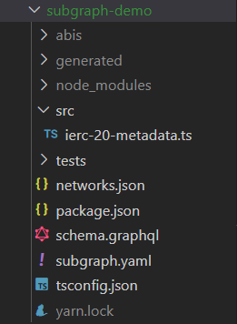

# Subgraph Development

## What is The Graph?

The Graph is an indexing protocol empowering applications to retrieve, aggregate in a stateful manner, then query data from a blockchain through a customizable and abstracted approach.
Before The Graph, dApps had to build their own data pipeline to fetch the history of targeted smart contracts, store the raw information and create specialized solutions to process it before serving their end users.

## What is an event?

The EVM has a logging functionality used to “write” data outside smart contracts though emitting formatted logs called events. Events allow smart contracts to “print” information on the blockchain in a way that is more searchable and gas efficient than just saving it to their public storage.

These logs are associated with the address of the emitting contract, immutable once persisted into the blockchain and accessible at any time. The event logs are not accessible from within contracts (not even from the contract that created them). It is their inaccessibility to smart contracts that makes them cheaper to emit.

Emitting events enables the possibility to:

- Test smart contracts for conditions and invariants
- Reconstruct a contract`s state by indexing and aggregating past logs
- Listen for specific events to trigger an offchain operation
- Access large blockchain data faster and more structured than reading it directly from smart contracts

The definition of an event in the Solidity language looks like:

```solidity
event Transfer(address indexed from, address indexed to, uint256 value);
```

You can think of this as a new special type. We have created a “type” of event called `Transfer`. The event name is called and can hold a number of variables. There are two kinds of enclosed parameters: indexed and non-indexed. You can assign the attribute `indexed` to up to three parameters which adds them to a special data structure known as `topics` instead of the data part of the log. A topic can only hold a single word (32 bytes) so if you use a reference type for an indexed argument, the keccak256 hash of the value is stored as a topic instead.
All parameters without the indexed attribute are ABI-encoded into the data part of the log.

Topics enable filtered search of events at the granularity of indexed parameters. For example, can fetch only `Transfer` events in a blocks range between two specific wallets, `from` and `to`.

Can emit an event within the defining contract as:

```solidity
function _transfer(address sender, address recipient, uint256 amount) internal virtual {
  _balances[sender] -= amount;
  _balances[recipient] += amount;

  emit Transfer(sender, recipient, amount);
}
```

Now, anytime we call the `_transfer` function in this example, it will emit an event of type `Transfer`.

Example of a `Transfer` log instance within a random transaction as displayed on the klaytn explorer:


### Emitted logs are stored on the blockchain as:

- Address: the address of the contract or account that emitted the event.
- Topics: the values (or hashes) of the indexed parameters of the event, the first topic representing the hash of the signature of the event definition.
- Data: the ABI-encoded non-indexed parameters logged by this event instance.

## What is a subgraph?

The Graph facilitates the building of custom open APIs through “subgraphs”. A subgraph represents a packed configuration that instructs an indexer node (server) which data to index from a blockchain and how to aggregate it before storing the results structurally into a Postgres database. The indexer exposes each hosted subgraph through a GraphQL endpoint, allowing users to query the data it managed to process so far.

## Subgraph development dependencies

In order to install The Graph CLI, `npm` or `yarn` should be installed either on your machine or on a VSCode development container extending the `nodejs` docker image.

Install with npm (possibly under `sudo` privileges):

```
npm install -g @graphprotocol/graph-cli
```

Install with yarn (possibly under `sudo` privileges):

```
yarn global add @graphprotocol/graph-cli
```

Additionally, there is the Graph Typescript Library which contains utilities for interacting with the entities store and conveniences for handling smart contract data:

```
npm install --dev @graphprotocol/graph-ts
```

or

```
yarn add --dev @graphprotocol/graph-ts
```

&nbsp;

## Creating a subgraph

Once The Graph CLI has been installed, the `graph init` command can be used to set up a new subgraph project.
For Klaytn (EVM-compatible chain) the protocol is `ethereum`, the subgraph project will be created locally using the `subgraph-studio` option, the published source code of the targeted contract is searched only on the Ethereum explorer, therefore the ABI of the contract should be manually supplied instead.
The subgraph slug can be left blank as the subgraph is not meant to be run remotely on The Graph`s hosted service, not supporting Klaytn.

```sh
graph init
```

On successfully running `graph init` the console should look similar to:

```
graph init
✔ Protocol · ethereum
✔ Product for which to initialize · subgraph-studio
✔ Subgraph slug ·
✔ Directory to create the subgraph in · subgraph-demo
? Ethereum network …
✔ Ethereum network · mainnet
✔ Contract address · 0xc6a2ad8cc6e4a7e08fc37cc5954be07d499e7654
✖ Failed to fetch ABI from Etherscan: ABI not found, try loading it from a local file
✔ ABI file (path) · ./abis/IERC20.json
✔ Contract Name · IERC20
———
  Generate subgraph
  Write subgraph to directory
✔ Create subgraph scaffold
✔ Initialize networks config
✔ Initialize subgraph repository
✔ Install dependencies with yarn
✔ Generate ABI and schema types with yarn codegen
✔ Add another contract? (y/N) · false

Subgraph  created in subgraph-demo
```

while the contents of the `subgraph-demo` directory as:



&nbsp;

## Subgraph's components:

The subgraph project exposes the following configuration files:

- Manifest – subgraph.yaml

A manifest supplies information about data sources, templates, and some metadata for the subgraph (description, repository, etc.). The manifest defines the smart contracts to be indexed by a subgraph, the relevant events on the smart contracts, and how to map event data to the entity types that the Graph Node will store in order to be accessed later.

- Schema – schema.graphql

This file contains the subgraph's GraphQL schema which dictates how stored data is linked and structured to be suitable for the needs of the dApps querying it. The entities defined here are the object types where event data will be cumulatively aggregated, they define the structure of the Postgres tables to be created for the subgraph and the actual objects storing global data of the subgraph (each entity can be loaded during indexing, modified and stored back atomically within a mapping handler).

- AssemblyScript Mappings – src/mapping.ts

Contains the logic that transforms received event data into entity modifications to be applied on the store. For each event targeted in the manifest there is an associated handler receiving an instance log of that event as the sole argument. Within the handler, the subgraph developer can access existing objects of some entity type, modify or delete them or create new ones. The mapping handlers are written in AssemblyScript, a subset of TypeScript, which can be compiled to WASM (WebAssembly).

&nbsp;

### Defining the manifest:

The manifest contains the location of the schema and mappings files along with the data sources producing the incoming event data. When using the Graph scaffolding command (graph init), the schema file is generated and named `schema.graphql` and unimplemented handlers placed in `mapping.ts` within the `src` directory. &nbsp;

An example of subgraph.yaml would look like this:

```yaml
specVersion: 0.0.4
schema:
  file: "./schema.graphql"
dataSources:
  - kind: ethereum
    name: KlaySwapProtocol
    network: klaytn
    source:
      address: "0xc6a2ad8cc6e4a7e08fc37cc5954be07d499e7654"
      abi: IERC20
      startBlock: 42654238
    mapping:
      kind: ethereum/events
      apiVersion: 0.0.6
      language: wasm/assemblyscript
      entities:
        - Account
        - Balance
        - Transfer
      abis:
        - name: IERC20
          file: ./abis/IERC20.json
      eventHandlers:
        - event: Transfer(indexed address,indexed address,uint256)
          handler: handleTransfer
      file: ./src/mapping.ts
```

```yaml
schema:
file: ./schema.graphql
```

Provide the path to your subgraph's GraphQL schema file.

```yaml
dataSources:
  – kind: ethereum
    name: KlaySwapProtocol
    network: klaytn
    source:
      address: "0xc6a2ad8cc6e4a7e08fc37cc5954be07d499e7654"
      abi: IERC20
      startBlock: 42654238
```

Describes the data source that is sourcing blockchain events to look after.

`kind`: the blockchain type which in this case is EVM-compatible - `ethereum`.
`name`: the name given to this specific data source to differentiate it from others.
`network`: identifier of network where the subgraph is supposed to operate, should match the network supplied for the provider URL on the indexer node configuration.
`address`: specific contract whose events are being targeted, intentionally left blank when instructing the subgraph to consider all logs matching on the event signatures alone, regardless of the emitting contract.

`abi` specifies the name of the contract within the ABI file.
`startBlock` signals the indexer from which block to start searching for targeted events. It is recommended to use the creation block of the contract if supplied, otherwise the syncing process will take longer starting from the genesis block without finding any relevant events.

```
dataSources.mapping.entities
```

The subset of the entities defined in schema that will be written to the store by this data source.

```yaml
abis:
  – name: IERC20
    file: ./abis/IERC20.json
```

One or more named ABI files for the source contract as well as any other smart contracts that the subgraph interacts with from within the mapping handlers.

```yaml
eventHandlers:
  - event: Transfer(indexed address,indexed address,uint256)
    handler: handleTransfer
```

List of the smart contract events this data source fetches from the blockchain and the name of the associated handler for each one.
The data source defined in this example manifest fetches only the instances of the `Transfer` event described in the previous section. The associated handler `handleTransfer` will be executed for each of these logs emitted on the blockchain in chronological order and sequentially.

&nbsp;

Additional information about specifying method call and block handles on https://thegraph.com/docs/en/developing/creating-a-subgraph/#the-subgraph-manifest.

&nbsp;

### Defining the GQL schema

Let's consider the case where a dApp (a chain explorer) has to access the balance of a wallet over all owned ERC20 tokens at the moment as well as the history of all outgoing transfers made by the wallet.

In this section we are going to explore how to structure and link data to meet this specification. As discussed before, every single GQL query will be made against the entities defined at this stage which makes the data model of upmost importance in meeting these requirements.

Defining entity types happens at the level of `schema.graphql` and the available options for querying the subgraph come down to either single instance or collections of an entity type.

A suitable definition of the schema would be:

```graphql
type Balance @entity {
  id: ID!
  token: Bytes!
  account: Account!
  amount: BigInt!
}

type Transfer @entity {
  id: ID!
  token: Bytes!
  from: Account!
  to: Account!
  value: BigInt!
  transaction: Bytes!
  block: BigInt!
}

type Account @entity {
  id: ID!
  balances: [Balance!]! @derivedFrom(field: "account")
  transfersOut: [Transfer!]! @derivedFrom(field: "from")
}
```

The semantics of the defined entities are the following:

`Balance`:
Entity incorporating the `amount` of ERC20 of address `token` the wallet of address `account` owns.<br />
In order to ensure uniqueness, the entity objects have to be indexed by a composite `id` of `account` + `token` which is constructed within `handlerTransfer` handler.<br />
The `token` and `account` fields are redundant but easier to access than deconstructing `id`, the latter acting as a reverse-lookup for the owning wallet - `Account` as discussed later.

`Transfer`:
Entity incorporating an individual ERC20 transfer of `value` of ERC20 of address `token` from source `from` to destination `to`, emitted within the transaction of hash `transaction` mined on block number `block`.<br />
Compared to the `Balance` entity, a wallet could have done multiple transfers using the same token which does not guarantee uniqueness among the objects of this entity. Instead `id` can be constructed from the block number + log index of the emitted event also accessible inside the handler.

`Account`:
Entity incorporating the list of `Balance` objects and the list of `Transfer` objects referencing the wallet's address used as `id` within instances of this entity type.

&nbsp;

#### Entity relationships

An entity may have a relationship to one or more other entities in the schema. These relationships are available only at query time. Relationships in The Graph are unidirectional. It is possible to simulate bidirectional relationships by defining a unidirectional one on either "end" of the relationship.

Relationships are defined on entities just like any other field except that the type specified is that of another entity.

- One-To-One

The `Balance` entity defines an one-to-one relationship to the `Account` entity at field `account`. Consequently, inside a query for single or collection `Balance` entities, `account` can be unfold using a nested inner query to access its containing fields.

- One-To-Many

The `Account` entity defines two one-to-many relationships to the `Balance` and `Transfer` entities via the `@derivedFrom` directive. However, the list of `Balance` or `Transfer` objects belonging to a specific `Account` is constructed and accessible only at query time, outside subgraph's handlers.<br />
Emulating one-to-many relationships in this manner increases the performance for both indexing and querying the subgraph, compared to storing an array of entities on the 'many' side and explicitly updating it.

- Many-To-Many

Regarding a many-to-many relationship, such as a wallet owning any number of distinct ERC20 tokens and the latter having multiple holders at once, the straightforward, but not scalable approach would be to model the relationship as derived on one side entity and explicitly stored on the other one.

For example, the above schema should be extended by defining a `Token` entity having a list of `Account` holders that should be directly maintained in handlers, while `Account` entity will have its list of owned tokens resolved at query time by finding all `Token` objects including the wallet within their `holders`.

```graphql
type Token @entity {
  id: ID!
  holders: [Account!]!
}

type Account @entity {
  ...
  tokens: [Token!]! @derivedFrom(field: "holders")
}
```

More information about the supported field-types, entity immutability and relationships on https://thegraph.com/docs/en/developing/creating-a-subgraph/#the-graph-ql-schema.

### Code generation

Instances of the entities defined in the subgraph's schema will end up being written to the Postgres store. In order to instruct the indexer node on how to process each trigger originating from the data source into entities, some form of "handlers" will have to be implemented.
The `graph codegen` command generates type-safe classes in AssemblyScript for each entity and event in order to access their fields inside the handlers. In case of entities, generated classes also provide an interface to the underlying store for loading/storing the entity itself.

For each entity the class being generated provides:

- type-safe entity loading from the store though `load` method

- getters and setters for the entity's fields

- `save` and `remove`  methods to write a whole entity on the store

For each event there the class being generated provides getters for the event's attributes and the metadata of the block and transaction where it has been emitted.

Can import these classes within `mapping.ts` as follows:

```typescript
import { Transfer } from "../generated/KlaySwapProtocol/IERC20";
import {
  Account,
  Balance,
  Transfer as TransferEntity,
} from "../generated/schema";
```

Run `graph codegen` command from the same directory where `subgraph.yaml` is located:

```
  Skip migration: Bump mapping apiVersion from 0.0.1 to 0.0.2
  Skip migration: Bump mapping apiVersion from 0.0.2 to 0.0.3
  Skip migration: Bump mapping apiVersion from 0.0.3 to 0.0.4
  Skip migration: Bump mapping apiVersion from 0.0.4 to 0.0.5
  Skip migration: Bump mapping apiVersion from 0.0.5 to 0.0.6
  Skip migration: Bump manifest specVersion from 0.0.1 to 0.0.2
  Skip migration: Bump manifest specVersion from 0.0.2 to 0.0.4
✔ Apply migrations
✔ Load subgraph from subgraph.yaml
  Load contract ABI from abis/IERC20.json
✔ Load contract ABIs
  Generate types for contract ABI: IERC20 (abis/IERC20.json)
  Write types to generated/KlaySwapProtocol/IERC20.ts
✔ Generate types for contract ABIs
✔ Generate types for data source templates
✔ Load data source template ABIs
✔ Generate types for data source template ABIs
✔ Load GraphQL schema from schema.graphql
  Write types to generated/schema.ts
✔ Generate types for GraphQL schema

Types generated successfully
```

> **_Important:_** After each change to the ABIs imported in the manifest or the GraphQL schema, code generation must be performed again to capture the latest changes.

More information about the code generation phase at https://thegraph.com/docs/en/developing/creating-a-subgraph/#code-generation.

### Defining the mappings

Mapping handlers describe how the sourced data should be transformed into modifications on the entities defined in the schema. The mappings have to be written in a subset of TypeScript called AssemblyScript which can be compiled directly to WASM (WebAssembly).

For each event handler defined in `subgraph.yaml` under `eventHandlers` section there should be an `export`ed function of the same name implemented in `mapping.ts`. Each event handler has to accept a single parameter `event` of type equal to the class generated for this event from the ABI specification.

On our example subgraph there is one handler capturing `Transfer` events from an ERC20 contract and is implemented as:

```typescript
import { BigInt } from "@graphprotocol/graph-ts";
import { Transfer } from "../generated/KlaySwapProtocol/IERC20";
import {
  Account,
  Balance,
  Transfer as TransferEntity,
} from "../generated/schema";

function createAccount(address: string): void {
  let account = Account.load(address);
  if (!account) {
    account = new Account(address);
    account.save();
  }
}

export function handleTransfer(event: Transfer): void {
  createAccount(event.params.to.toHex());
  let id = event.params.to.toHex().concat(event.address.toHex());
  let balance = Balance.load(id);
  if (!balance) {
    balance = new Balance(id);
    balance.token = event.address;
    balance.account = event.params.to.toHex();
    balance.amount = BigInt.zero();
  }
  balance.amount = balance.amount.plus(event.params.value);
  balance.save();

  createAccount(event.params.from.toHex());
  id = event.params.from.toHex().concat(event.address.toHex());
  balance = Balance.load(id);
  if (!balance) {
    balance = new Balance(id);
    balance.token = event.address;
    balance.account = event.params.from.toHex();
    balance.amount = BigInt.zero();
  }
  balance.amount = balance.amount.minus(event.params.value);
  balance.save();

  // do not have to load `Transfer` entity as it is unique each time
  id = event.block.number.toString().concat(event.logIndex.toString());
  let transfer = new TransferEntity(id);
  transfer.token = event.address;
  transfer.from = event.params.from.toHex();
  transfer.to = event.params.to.toHex();
  transfer.value = event.params.value;
  transfer.transaction = event.transaction.hash;
  transfer.block = event.block.number;
  transfer.save();
}
```

There is a single handler `handleTransfer` which receives a `Transfer` event as the sole argument and has to update affected entities accordingly to the specification.<br />
An ERC20 transfer is changing the balances of both the source and destination wallets given by `from` and `to` fields of the received event.<br />
Even though `Account` has only "derived" fields, we still have to create both entities on the store to make instances of this entity available at query time.<br />
The handler then proceeds to create/update the `Balance` entities associated to both accounts for the ERC20 emitting the log. The subgraph is more general and able to construct balances in all existing tokens on the blockchain, however in our case we filter only logs emitted by `source.address` (in the manifest).<br />

Nonetheless, the subgraph should also store a new `Transfer` in order to record the unique transfer for later retrieval of a wallet's history by the dApp.

&nbsp;

#### Building the subgraph

The handlers code in `src/mapping.ts` is neither checked nor compiled into WASM at the code generation phase. `graph build` command will handle the compilation and highlight any syntax and type errors encountered.
Once all the compile errors have been fixed, the subgraph bytecode can be deployed to the indexer.

&nbsp;

#### Create and deploy the compiled subgraph

The commands required to install the subgraph on the indexer are:

```
graph create --node http(s)://<indexer-node-hostname>:8020 <subgraph-name>
graph deploy --node http(s)://<indexer-node-hostname>:8020 --ipfs http(s)://<ipfs-node-hostname>:5001 <subgraph-name>
```

### Querying a subgraph

After the subgraph has been deployed on the indexer node and the indexing starts, the subgraph becomes available in the local browser on the explorer page at port `8000` and path `/subgraphs/name/<subgraph-name>/graphql` or for directly querying at path `/subgraphs/name/<subgraph-name>`.

```graphql
{
  account(id: "0x2968c66f14308673c12812febfa58cfe87c4e5a8") {
    balances(first: 1000) {
      token
      amount
    }
  }
}
```

This query returns all `Balance` objects associated to the provided address (or the first 1000 of them), sorted ascending by their ids along with the nested data of token address and balance value for each one. This query executes by default in the context of the latest indexed block.

#### Time-travel queries

You can query the state of an entity not just at the latest indexed block (default option) but also in the context of an arbitrary past block. This block can be specified either by its number or hash by including the `block` field into the toplevel arguments of the query.

```graphql
{
  account(
    id: "0x2968c66f14308673c12812febfa58cfe87c4e5a8"
    block: { number: 49548688 }
  ) {
    balances(first: 1000) {
      token
      amount
    }
  }
}
```

This query returns the list of balances of the provided address as they were at a particular block.
